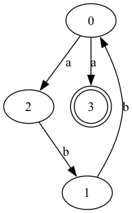
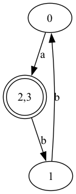
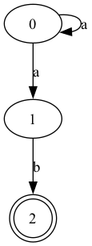
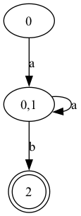

# Documentação Técnica

## Resumo

Este documento explica, de forma detalhada, como implementar e usar um sistema. Ele traz informações sobre a organização do código, exemplos práticos de entrada e saída que ajudam a entender como tudo funciona.

---

## Estrutura do Código

- **`main.py`**:
  - Arquivo principal para execução do programa.
  - Oferece dois modos de operação:
    - **Modo Base**: Executa um exemplo pré-definido.
    - **Modo Interativo**: Permite ao usuário criar autômatos personalizados.

- **`automata.py`**:
  - Contém funções auxiliares para:
    - Adicionar transições.
    - Calcular o **fecho vazio**.
    - Converter AFN para AFD.
    - Gerar gráficos visuais dos autômatos usando Graphviz.

---

## Dependências

Antes de executar o programa, certifique-se de instalar as seguintes dependências:

- **Python 3.8+**
- **Graphviz** (para visualização gráfica)
- Biblioteca Python:
  ```bash
  pip install graphviz
  ```

---

## Diagrama de Fluxo do Programa

O processo de conversão segue as etapas descritas no diagrama abaixo:

1. Entrada do Autômato Finito Não Determinístico (AFN).
2. Cálculo do **fecho vazio** para cada estado.
3. Construção dos estados e transições do AFD.
4. Identificação de estados finais no AFD.
5. Geração de gráficos visuais para o AFN e AFD.

---
# Exemplos de Uso

### Entrada Exemplo 1 (Modo Base):

```python
afn = {
    "alfabeto": {"a", "b"},
    "estados": {"0", "1", "2", "3"},
    "função_programa": {},
    "estado_inicial": "0",
    "estados_finais": {"3"},
}

adicionar_transicao(afn, "0", "a", "2")
adicionar_transicao(afn, "0", "a", "3")
adicionar_transicao(afn, "2", "b", "1")
adicionar_transicao(afn, "1", "b", "0")
```

**Saída Gerada:**

**Transições do AFN:**

```
0 -- a --> 2
0 -- a --> 3
2 -- b --> 1
1 -- b --> 0
```

**Transições do AFD:**

```
0 -- a --> 2,3
2,3 -- b --> 1
1 -- b --> 0
```

---

### Entrada Exemplo 2 (AFN Alternativo):

```python
afn = {
    "alfabeto": {"a", "b"},
    "estados": {"0", "1", "2"},
    "função_programa": {},
    "estado_inicial": "0",
    "estados_finais": {"2"},
}
adicionar_transicao(afn, "0", "a", "0")
adicionar_transicao(afn, "0", "a", "1")
adicionar_transicao(afn, "1", "b", "2")
```

**Saída Gerada:**

**Transições do AFN:**

```
0 -- a --> 1
0 -- a --> 0
1 -- b --> 2
```

**Transições do AFD:**

```
0 -- a --> 0,1
0,1 -- a --> 0,1
0,1 -- b --> 2
```

---

## Diagramas Gerados

Os gráficos do AFN e AFD são gerados automaticamente e salvos na pasta `assets`. Para os exemplos acima:

- **AFN (Exemplo 1)**:
  

- **AFD (Exemplo 1)**:
  

- **AFN (Exemplo 2)**:
  

- **AFD (Exemplo 2)**:
  

---

## Observações

1. Certifique-se de que o **Graphviz** está corretamente configurado no sistema:
   - **Windows**: Adicione o caminho do executável `dot.exe` ao PATH.
   - **Linux/Mac**: Verifique a instalação com `dot -version`.

2. Use o comando `python main.py --base` para rodar o exemplo pré-definido.

3. Execute `python main.py` para o modo interativo.

---

<div align="center">
Feito com ♥ por <strong>Alunos UFMA</strong>
</div>
